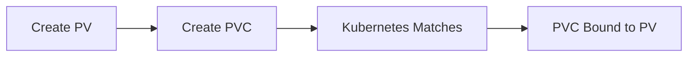
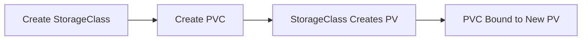
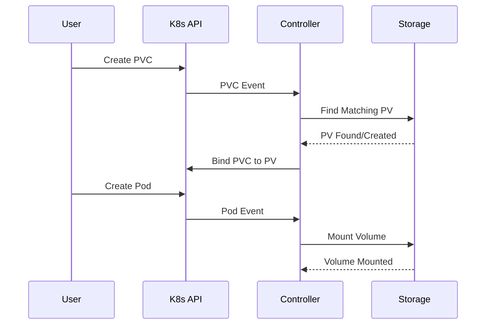
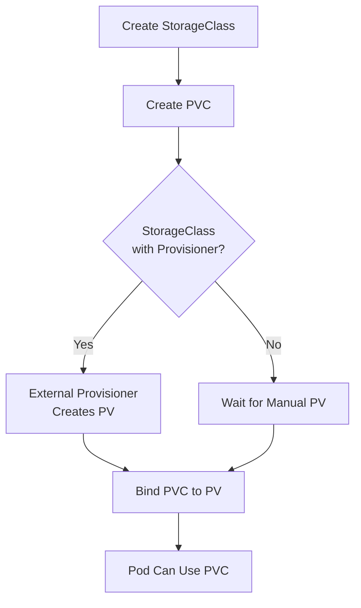

# 📚 Kubernetes Storage Tutorial: PV, PVC, and StorageClass

This tutorial provides a comprehensive understanding of Kubernetes storage concepts through practical examples and hands-on exercises.

## Table of Contents
1. [Storage Fundamentals](#storage-fundamentals)
2. [PersistentVolume (PV) Deep Dive](#persistentvolume-pv-deep-dive)
3. [PersistentVolumeClaim (PVC) Deep Dive](#persistentvolumeclaim-pvc-deep-dive)
4. [StorageClass Deep Dive](#storageclass-deep-dive)
5. [Storage Lifecycle](#storage-lifecycle)
6. [Hands-On Exercises](#hands-on-exercises)
7. [Best Practices](#best-practices)
8. [Troubleshooting Guide](#troubleshooting-guide)

---

## Storage Fundamentals

### Why Kubernetes Storage?

In containerized environments, storage presents unique challenges:

- **Ephemeral nature**: Containers are stateless by design
- **Pod lifecycle**: When pods die, their data disappears
- **Scaling requirements**: Applications need persistent data across replicas
- **Cloud portability**: Storage should work across different environments

Kubernetes storage abstractions solve these problems by:
- Decoupling storage from pod lifecycle
- Providing consistent APIs across storage types
- Enabling dynamic provisioning and management

### Storage Architecture Overview

```
┌─────────────────────────────────────────────────────────────────┐
│                         Kubernetes Cluster                     │
│                                                                 │
│  ┌─────────────┐    ┌─────────────┐    ┌─────────────┐         │
│  │    Pod A    │    │    Pod B    │    │    Pod C    │         │
│  │             │    │             │    │             │         │
│  │  ┌───────┐  │    │  ┌───────┐  │    │  ┌───────┐  │         │
│  │  │ Volume│  │    │  │ Volume│  │    │  │ Volume│  │         │
│  │  │ Mount │  │    │  │ Mount │  │    │  │ Mount │  │         │
│  │  └───┬───┘  │    │  └───┬───┘  │    │  └───┬───┘  │         │
│  └──────┼──────┘    └──────┼──────┘    └──────┼──────┘         │
│         │                  │                  │                │
│  ┌──────▼──────┐    ┌──────▼──────┐    ┌──────▼──────┐         │
│  │     PVC     │    │     PVC     │    │     PVC     │         │
│  │   (Claim)   │    │   (Claim)   │    │   (Claim)   │         │
│  └──────┬──────┘    └──────┬──────┘    └──────┬──────┘         │
│         │                  │                  │                │
│         └──────────────────┼──────────────────┘                │
│                            │                                   │
│                    ┌───────▼───────┐                           │
│                    │      PV       │                           │
│                    │ (Physical     │                           │
│                    │  Storage)     │                           │
│                    └───────────────┘                           │
└─────────────────────────────────────────────────────────────────┘
```

### Key Concepts

1. **Abstraction Layers**: Kubernetes provides multiple layers of abstraction
2. **Declarative Management**: Resources are defined through YAML manifests
3. **Binding Process**: Automatic matching of claims to volumes
4. **Lifecycle Management**: Independent lifecycles for different components

---

## PersistentVolume (PV) Deep Dive

### What is a PersistentVolume?

A PersistentVolume (PV) represents a piece of storage in the cluster that has been provisioned by an administrator or dynamically provisioned using Storage Classes.

### Key Characteristics

#### 1. Cluster-Scoped Resource
```yaml
apiVersion: v1
kind: PersistentVolume
metadata:
  name: my-pv  # Available cluster-wide, not namespace-specific
```

#### 2. Independent Lifecycle
- Exists beyond any individual pod
- Survives pod deletion and recreation
- Can be reused by different pods

#### 3. Storage Abstraction
- Hides implementation details of underlying storage
- Provides consistent interface across storage types

### PV Specifications

#### Storage Capacity
```yaml
spec:
  capacity:
    storage: 10Gi  # Total available storage
```

#### Access Modes

```yaml
spec:
  accessModes:
    - ReadWriteOnce   # RWO: Single node, read-write
    - ReadOnlyMany    # ROX: Multiple nodes, read-only
    - ReadWriteMany   # RWX: Multiple nodes, read-write
```

**Access Mode Details:**

| Mode | Abbreviation | Description | Use Cases |
|------|--------------|-------------|-----------|
| ReadWriteOnce | RWO | Volume can be mounted as read-write by a single node | Databases, file systems |
| ReadOnlyMany | ROX | Volume can be mounted read-only by many nodes | Static content, configurations |
| ReadWriteMany | RWX | Volume can be mounted as read-write by many nodes | Shared file systems, distributed storage |

#### Reclaim Policy

```yaml
spec:
  persistentVolumeReclaimPolicy: Retain  # Retain | Delete | Recycle
```

**Reclaim Policies:**

- **Retain**: Manual reclamation (default for manually created PVs)
- **Delete**: Automatic deletion when PVC is deleted
- **Recycle**: Deprecated - performs basic scrub (`rm -rf /thevolume/*`)

#### Storage Classes

```yaml
spec:
  storageClassName: fast-ssd  # Links to StorageClass
```

### Volume Types

#### Local Storage (hostPath)
```yaml
spec:
  hostPath:
    path: /mnt/data
    type: DirectoryOrCreate
```

**hostPath Types:**
- `DirectoryOrCreate`: Create directory if it doesn't exist
- `Directory`: Directory must exist
- `File`: File must exist
- `Socket`: Unix socket must exist

#### Network Storage (NFS)
```yaml
spec:
  nfs:
    server: nfs-server.example.com
    path: /exported/path
```

#### Cloud Storage (AWS EBS)
```yaml
spec:
  awsElasticBlockStore:
    volumeID: vol-1234567890abcdef0
    fsType: ext4
```

### Complete PV Example

```yaml
apiVersion: v1
kind: PersistentVolume
metadata:
  name: example-pv
  labels:
    type: local
    environment: development
spec:
  capacity:
    storage: 5Gi
  accessModes:
    - ReadWriteOnce
  persistentVolumeReclaimPolicy: Retain
  storageClassName: manual
  hostPath:
    path: /tmp/data
    type: DirectoryOrCreate
  nodeAffinity:
    required:
      nodeSelectorTerms:
      - matchExpressions:
        - key: kubernetes.io/hostname
          operator: In
          values:
          - node-1
```

---

## PersistentVolumeClaim (PVC) Deep Dive

### What is a PersistentVolumeClaim?

A PersistentVolumeClaim (PVC) is a request for storage by a user. It's similar to a pod consuming node resources - PVCs consume PV resources.

### Key Characteristics

#### 1. Namespace-Scoped
```yaml
apiVersion: v1
kind: PersistentVolumeClaim
metadata:
  name: my-claim
  namespace: default  # Lives in a specific namespace
```

#### 2. Storage Request
- Specifies desired storage characteristics
- Kubernetes finds matching PV or creates one dynamically

#### 3. Pod Consumption
- Pods reference PVCs, not PVs directly
- Provides abstraction layer for applications

### PVC Specifications

#### Resource Requests
```yaml
spec:
  resources:
    requests:
      storage: 3Gi  # Minimum storage required
```

#### Access Modes
```yaml
spec:
  accessModes:
    - ReadWriteOnce  # Must match or be subset of PV access modes
```

#### Storage Class Selection
```yaml
spec:
  storageClassName: fast-ssd  # Specific StorageClass
  # storageClassName: ""      # Empty string = no StorageClass
  # No storageClassName       # Default StorageClass
```

#### Selectors
```yaml
spec:
  selector:
    matchLabels:
      environment: production
    matchExpressions:
    - key: tier
      operator: In
      values: ["cache"]
```

### PVC Binding Process

#### 1. Manual Binding (Static Provisioning)


#### 2. Dynamic Binding (Dynamic Provisioning)


### PVC States

| Phase | Description |
|-------|-------------|
| Pending | PVC is created but not yet bound to a PV |
| Bound | PVC is bound to a PV |
| Lost | PV associated with PVC is lost |

### Complete PVC Example

```yaml
apiVersion: v1
kind: PersistentVolumeClaim
metadata:
  name: database-claim
  namespace: production
  labels:
    app: database
    tier: storage
spec:
  accessModes:
    - ReadWriteOnce
  resources:
    requests:
      storage: 20Gi
  storageClassName: fast-ssd
  selector:
    matchLabels:
      environment: production
      type: database
```

---

## StorageClass Deep Dive

### What is a StorageClass?

A StorageClass provides a way for administrators to describe the "classes" of storage they offer. Different classes might map to quality-of-service levels, backup policies, or arbitrary policies determined by cluster administrators.

### Key Characteristics

#### 1. Dynamic Provisioning
- Automatically creates PVs when PVCs are created
- Eliminates need for pre-provisioned storage

#### 2. Storage Parameters
- Defines storage-specific configuration
- Enables fine-tuned storage behavior

#### 3. Provisioner-Specific
- Each cloud provider has specific provisioners
- Supports various storage backends

### StorageClass Components

#### Provisioner
```yaml
provisioner: kubernetes.io/aws-ebs  # Storage system to use
```

**Common Provisioners:**
- `kubernetes.io/aws-ebs` - Amazon EBS
- `kubernetes.io/gce-pd` - Google Cloud Persistent Disk
- `kubernetes.io/azure-disk` - Azure Disk
- `kubernetes.io/no-provisioner` - Static provisioning only

#### Parameters
```yaml
parameters:
  type: gp2              # Storage type
  fsType: ext4           # File system type
  encrypted: "true"      # Encryption enabled
```

#### Volume Binding Mode
```yaml
volumeBindingMode: WaitForFirstConsumer  # Immediate | WaitForFirstConsumer
```

**Binding Modes:**
- **Immediate**: Bind and provision immediately when PVC is created
- **WaitForFirstConsumer**: Delay binding until pod using PVC is scheduled

#### Reclaim Policy
```yaml
reclaimPolicy: Delete  # Delete | Retain
```

#### Allow Volume Expansion
```yaml
allowVolumeExpansion: true  # Enable volume resize
```

### Cloud Provider Examples

#### AWS EBS StorageClass
```yaml
apiVersion: storage.k8s.io/v1
kind: StorageClass
metadata:
  name: fast-ebs
provisioner: kubernetes.io/aws-ebs
parameters:
  type: gp3
  fsType: ext4
  encrypted: "true"
  iops: "3000"
  throughput: "125"
volumeBindingMode: WaitForFirstConsumer
allowVolumeExpansion: true
reclaimPolicy: Delete
```

#### Google Cloud PD StorageClass
```yaml
apiVersion: storage.k8s.io/v1
kind: StorageClass
metadata:
  name: fast-ssd
provisioner: kubernetes.io/gce-pd
parameters:
  type: pd-ssd
  replication-type: regional-pd
  zones: us-central1-a,us-central1-b
volumeBindingMode: WaitForFirstConsumer
allowVolumeExpansion: true
```

#### Local Storage StorageClass
```yaml
apiVersion: storage.k8s.io/v1
kind: StorageClass
metadata:
  name: local-storage
provisioner: kubernetes.io/no-provisioner
volumeBindingMode: WaitForFirstConsumer
reclaimPolicy: Delete
```

### Default StorageClass

```yaml
apiVersion: storage.k8s.io/v1
kind: StorageClass
metadata:
  name: standard
  annotations:
    storageclass.kubernetes.io/is-default-class: "true"
provisioner: kubernetes.io/gce-pd
parameters:
  type: pd-standard
```

---

## Storage Lifecycle

### Complete Workflow

#### 1. Admin Phase (Static Provisioning)
```bash
# Create StorageClass
kubectl apply -f storageclass.yaml

# Create PersistentVolume
kubectl apply -f pv.yaml
```

#### 2. User Phase
```bash
# Create PersistentVolumeClaim
kubectl apply -f pvc.yaml

# Create Pod that uses PVC
kubectl apply -f pod.yaml
```

#### 3. Binding Process


### Dynamic Provisioning Workflow



### Volume Lifecycle States

#### PV States
- **Available**: Free resource, not bound to claim
- **Bound**: Volume is bound to a claim
- **Released**: Claim has been deleted, but not reclaimed
- **Failed**: Volume has failed its automatic reclamation

#### PVC States
- **Pending**: Waiting for binding
- **Bound**: Successfully bound to PV
- **Lost**: Associated PV is lost

---

## Hands-On Exercises

### Exercise 1: Basic Static Provisioning

#### Step 1: Create StorageClass
```yaml
# storage-class-basic.yaml
apiVersion: storage.k8s.io/v1
kind: StorageClass
metadata:
  name: manual
provisioner: kubernetes.io/no-provisioner
volumeBindingMode: WaitForFirstConsumer
reclaimPolicy: Retain
```

#### Step 2: Create PersistentVolume
```yaml
# pv-basic.yaml
apiVersion: v1
kind: PersistentVolume
metadata:
  name: task-pv-volume
  labels:
    type: local
spec:
  storageClassName: manual
  capacity:
    storage: 1Gi
  accessModes:
    - ReadWriteOnce
  hostPath:
    path: "/tmp/data"
```

#### Step 3: Create PersistentVolumeClaim
```yaml
# pvc-basic.yaml
apiVersion: v1
kind: PersistentVolumeClaim
metadata:
  name: task-pv-claim
spec:
  storageClassName: manual
  accessModes:
    - ReadWriteOnce
  resources:
    requests:
      storage: 1Gi
```

#### Step 4: Create Pod Using PVC
```yaml
# pod-basic.yaml
apiVersion: v1
kind: Pod
metadata:
  name: task-pv-pod
spec:
  volumes:
    - name: task-pv-storage
      persistentVolumeClaim:
        claimName: task-pv-claim
  containers:
    - name: task-pv-container
      image: nginx
      ports:
        - containerPort: 80
          name: "http-server"
      volumeMounts:
        - mountPath: "/usr/share/nginx/html"
          name: task-pv-storage
```

#### Commands to Run
```bash
# Apply resources
kubectl apply -f storage-class-basic.yaml
kubectl apply -f pv-basic.yaml
kubectl apply -f pvc-basic.yaml
kubectl apply -f pod-basic.yaml

# Check status
kubectl get storageclass
kubectl get pv
kubectl get pvc
kubectl get pods

# Test persistence
kubectl exec -it task-pv-pod -- /bin/bash
echo "Hello from PV" > /usr/share/nginx/html/index.html
exit

# Delete and recreate pod
kubectl delete pod task-pv-pod
kubectl apply -f pod-basic.yaml

# Verify data persistence
kubectl exec -it task-pv-pod -- cat /usr/share/nginx/html/index.html
```

### Exercise 2: Multiple Access Modes

#### ReadWriteMany Example
```yaml
# pv-rwx.yaml
apiVersion: v1
kind: PersistentVolume
metadata:
  name: shared-pv
spec:
  capacity:
    storage: 2Gi
  accessModes:
    - ReadWriteMany
  storageClassName: shared
  nfs:
    server: nfs-server.example.com
    path: /shared/data
```

#### Multiple Pods Sharing Volume
```yaml
# deployment-shared.yaml
apiVersion: apps/v1
kind: Deployment
metadata:
  name: shared-storage-app
spec:
  replicas: 3
  selector:
    matchLabels:
      app: shared-app
  template:
    metadata:
      labels:
        app: shared-app
    spec:
      containers:
      - name: app
        image: nginx
        volumeMounts:
        - name: shared-storage
          mountPath: /shared
      volumes:
      - name: shared-storage
        persistentVolumeClaim:
          claimName: shared-pvc
```

### Exercise 3: Volume Expansion

#### Create Expandable StorageClass
```yaml
# storage-class-expandable.yaml
apiVersion: storage.k8s.io/v1
kind: StorageClass
metadata:
  name: expandable
provisioner: kubernetes.io/aws-ebs
parameters:
  type: gp2
allowVolumeExpansion: true
```

#### Test Expansion
```bash
# Create PVC with 1Gi
kubectl apply -f pvc-1gi.yaml

# Edit PVC to request 5Gi
kubectl patch pvc my-pvc -p '{"spec":{"resources":{"requests":{"storage":"5Gi"}}}}'

# Check expansion status
kubectl get pvc my-pvc -w
```

---

## Best Practices

### 1. StorageClass Design

#### Use Descriptive Names
```yaml
metadata:
  name: fast-ssd-retain    # Clear purpose
  # NOT: name: storage1    # Ambiguous
```

#### Define Multiple Classes
```yaml
# Development
apiVersion: storage.k8s.io/v1
kind: StorageClass
metadata:
  name: dev-standard
parameters:
  type: gp2
  
---
# Production
apiVersion: storage.k8s.io/v1
kind: StorageClass
metadata:
  name: prod-high-iops
parameters:
  type: io1
  iops: "1000"
```

### 2. PVC Management

#### Right-Size Storage Requests
```yaml
spec:
  resources:
    requests:
      storage: 10Gi  # Request what you need, not more
```

#### Use Labels for Organization
```yaml
metadata:
  labels:
    app: database
    tier: storage
    environment: production
```

### 3. Security Considerations

#### Encrypt Sensitive Data
```yaml
parameters:
  encrypted: "true"
  kmsKeyId: "arn:aws:kms:us-west-2:123456789012:key/12345678-1234-1234-1234-123456789012"
```

#### Use RBAC
```yaml
apiVersion: rbac.authorization.k8s.io/v1
kind: Role
metadata:
  name: pvc-manager
rules:
- apiGroups: [""]
  resources: ["persistentvolumeclaims"]
  verbs: ["get", "list", "create", "delete"]
```

### 4. Monitoring and Maintenance

#### Set Resource Quotas
```yaml
apiVersion: v1
kind: ResourceQuota
metadata:
  name: storage-quota
spec:
  hard:
    requests.storage: "100Gi"
    persistentvolumeclaims: "10"
```

#### Monitor Usage
```bash
# Check PV/PVC status
kubectl get pv,pvc --all-namespaces

# Monitor storage usage
kubectl top nodes
kubectl describe node <node-name>
```

---

## Troubleshooting Guide

### Common Issues and Solutions

#### 1. PVC Stuck in Pending State

**Symptoms:**
```bash
$ kubectl get pvc
NAME      STATUS    VOLUME   CAPACITY   ACCESS MODES   STORAGECLASS   AGE
my-pvc    Pending                                      standard       5m
```

**Causes and Solutions:**

**No Matching PV Available:**
```bash
# Check available PVs
kubectl get pv

# Check PVC details
kubectl describe pvc my-pvc
```

**Solution:** Create matching PV or fix StorageClass

**StorageClass Not Found:**
```bash
# Check if StorageClass exists
kubectl get storageclass

# Check PVC events
kubectl describe pvc my-pvc
```

**Insufficient Storage:**
```bash
# Check PV capacity
kubectl get pv -o custom-columns=NAME:.metadata.name,SIZE:.spec.capacity.storage,STATUS:.status.phase
```

#### 2. Pod Can't Mount Volume

**Symptoms:**
```bash
$ kubectl get pods
NAME      READY   STATUS    RESTARTS   AGE
my-pod    0/1     Pending   0          2m
```

**Check Events:**
```bash
kubectl describe pod my-pod
```

**Common Errors:**

**Volume Already Mounted (RWO):**
```
Warning FailedMount: Multi-Attach error for volume "pvc-xxx" Volume is already exclusively attached to one node and can't be attached to another
```

**Solution:** Use ReadWriteMany or ensure pod is on same node

**Node Affinity Mismatch:**
```
Warning FailedScheduling: 0/3 nodes are available: 3 node(s) didn't match pod affinity rules
```

**Solution:** Fix node affinity or use WaitForFirstConsumer

#### 3. Volume Mount Permission Issues

**Symptoms:**
```bash
$ kubectl logs my-pod
mkdir: cannot create directory '/data': Permission denied
```

**Solutions:**

**Security Context:**
```yaml
spec:
  securityContext:
    fsGroup: 2000
  containers:
  - name: app
    securityContext:
      runAsUser: 1000
      runAsGroup: 2000
```

**Init Container:**
```yaml
spec:
  initContainers:
  - name: volume-mount-hack
    image: busybox
    command: ["sh", "-c", "chmod 777 /data"]
    volumeMounts:
    - name: data
      mountPath: /data
```

#### 4. Dynamic Provisioning Not Working

**Check StorageClass:**
```bash
kubectl describe storageclass my-storage-class
```

**Check Provisioner:**
```bash
# For AWS EBS
kubectl get csidriver

# Check provisioner logs
kubectl logs -n kube-system -l app=ebs-csi-controller
```

#### 5. Volume Expansion Failures

**Check if StorageClass Supports Expansion:**
```bash
kubectl get storageclass -o custom-columns=NAME:.metadata.name,EXPANSION:.allowVolumeExpansion
```

**Check Expansion Status:**
```bash
kubectl describe pvc my-pvc
```

### Diagnostic Commands

#### Storage Overview
```bash
# Get all storage-related resources
kubectl get storageclass,pv,pvc --all-namespaces

# Check storage usage by nodes
kubectl describe nodes | grep -A 5 "Allocated resources"
```

#### Detailed Inspection
```bash
# PV details
kubectl get pv -o yaml my-pv

# PVC details with events
kubectl describe pvc my-pvc

# Storage class parameters
kubectl get storageclass my-storage-class -o yaml
```

#### Debug Pod Issues
```bash
# Check pod events
kubectl describe pod my-pod

# Check volume mounts
kubectl exec my-pod -- df -h

# Check permissions
kubectl exec my-pod -- ls -la /mount/path
```

### Debug Tools

#### Storage Inspector Pod
```yaml
apiVersion: v1
kind: Pod
metadata:
  name: storage-debug
spec:
  containers:
  - name: debug
    image: busybox
    command: ["sleep", "3600"]
    volumeMounts:
    - name: debug-volume
      mountPath: /debug
  volumes:
  - name: debug-volume
    persistentVolumeClaim:
      claimName: target-pvc
```

#### Volume Test Script
```bash
#!/bin/bash
# test-storage.sh

echo "Testing storage functionality..."

# Create test file
echo "Test data $(date)" > /debug/test.txt

# Check write permissions
if [ $? -eq 0 ]; then
    echo "✅ Write successful"
else
    echo "❌ Write failed"
    exit 1
fi

# Read test
if [ -f /debug/test.txt ]; then
    echo "✅ Read successful: $(cat /debug/test.txt)"
else
    echo "❌ Read failed"
    exit 1
fi

# Check disk space
df -h /debug
```

---

## Conclusion

Understanding Kubernetes storage requires grasping the relationship between StorageClasses, PersistentVolumes, and PersistentVolumeClaims. Each serves a specific purpose in the storage abstraction layer:

- **StorageClass**: Defines storage characteristics and provisioning behavior
- **PersistentVolume**: Represents actual storage resources in the cluster
- **PersistentVolumeClaim**: Requests storage with specific requirements

By mastering these concepts and following best practices, you can design robust, scalable storage solutions for your Kubernetes applications.

### Next Steps

1. **Practice**: Work through all exercises in this tutorial
2. **Experiment**: Try different StorageClass configurations
3. **Scale**: Test with multiple pods and volumes
4. **Production**: Apply learnings to real-world scenarios
5. **Advanced Topics**: Explore CSI drivers, volume snapshots, and cross-zone replication

### Additional Resources

- [Kubernetes Storage Documentation](https://kubernetes.io/docs/concepts/storage/)
- [CSI Driver Documentation](https://kubernetes-csi.github.io/docs/)
- [Cloud Provider Storage Guides](https://kubernetes.io/docs/concepts/storage/storage-classes/)
- [Storage Best Practices](https://kubernetes.io/docs/concepts/storage/persistent-volumes/#best-practices)
